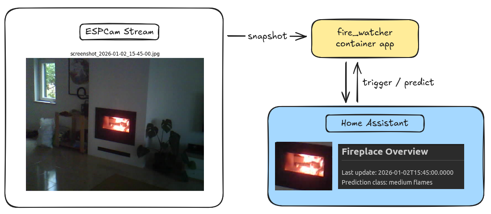

# Firewatcher


## Overview

**Firewatcher** is a proof-of-concept (POC) system designed to detect and categorize the amount of flame in a fireplace.

The system captures images from a video stream and classifies flame intensity. It exposes a REST API that integrates cleanly with **Home Assistant** for automations (e.g. notifications when only embers remain).

This project is intentionally minimal, serving as a base for future discussion, iteration, and improvement.

## POC - Training
### unsupervised labelling
- using kmean to label ~100 images into several clusters
- manually writting which cluster correspond to which class (e.g. black, ember, small flame, ...)
- labelling 1000 images bases on the kmean classifer

### classifier
- training Random Forest classifier on 1000 labelled images
- output: class [black, ember, small flame, medium flame, large flame]


## Deployment

Firewatcher can be deployed locally or on a remote machine (e.g., an LXC container). The project provides a `Makefile` and `docker-compose` setup to simplify building, transferring, and running the service.

### Prerequisites

- Python 3.11+ (if running locally)  
- Docker & Docker Compose (for containerized deployment)  
- `ssh` access if deploying to a remote host  
- Optional: `poetry` for managing dependencies locally  

### 1. Clone the repository

```bash
git clone <repo_url>
cd fire_detector/serving
``` 
### 2. Configure environment variables
Create a .env file in the serving/ folder with at least:

```.env
VM_USER=<remote_user>                # e.g., root
VM_HOST=<remote_host_ip>             # e.g., 192.168.1.100
VM_PATH=<remote_path_on_host>        # e.g., /home/user/firewatcher
OUTPUT_DIR_SCREENSHOT=/your/image/path
```

### 3. Build and run with Makefile

### 4. Deploy
#### Option 1 - Deploy on remote host
The Makefile provides commands to handle Docker image building and deployment.
Build the Docker image locally + Save the image as a tarball + Deploy to remote host
```bash
make deploy
```

This command will:
- Create necessary directories on the host (tmp, models, static).
- Copy local models/, static/, and .env files to the host.
- Load the Docker image and start the container.
- Set correct permissions for all folders. The deployment process uses variables from .env. Ensure the .env file is present locally and will be copied to the host.

To monitor the running container:
```bash
make logs
```

#### Option 2 - Deploy Locally
If you are deploying on the **same machine**, you don’t need `VM_USER`, `VM_HOST`, or `VM_PATH`. You can run the container directly with Docker Compose.

1. Make sure the `.env` file exists with at least:
```env
OUTPUT_DIR_SCREENSHOT=/your/image/path
```
2. (run only the first time)
```bash
make build
```

3. Start the container
```bash
docker-compose up -d
```

### 5. Access
Once the container is running, open:
```
http://<host_ip>:8000/home
```
And access:
- /home — Manual predictions and ROI display
- /update_polygon — Update fireplace polygon
- /scheduler — Manage scheduled data collection

**[Optional] Clean up**

Remove local Docker image and archive:
```bash
make clean
```

## Home assistant integration
### Create REST sensor

Using `File editor` go to Browse Filesystem: homeassistant/configuration.yaml to add a REST sensor.

```configuration.yaml
sensor:
  - platform: rest
    name: fireplace_flame
    resource: http://192.168.1.91:8000/trigger_predict
    method: GET
    scan_interval: 120  # seconds
    value_template: "{{ value_json }}"
    json_attributes:
      - confidence
      - orb_updated
      - label
      - timestamp
```

### Create Markdown card

```md
## Fireplace Overview
**Last update:** {{ state_attr('sensor.fireplace_flame', 'timestamp') }}
**Prediction class:** {{ state_attr('sensor.fireplace_flame', 'label') }}  
**Confidence:** {{ state_attr('sensor.fireplace_flame', 'confidence')|round(2) }}
```

result

> ## Fireplace Overview  
> Last update: 2026-01-02T15:45:00.0000  
> Prediction class: medium flames  
> Confidence: 0.56